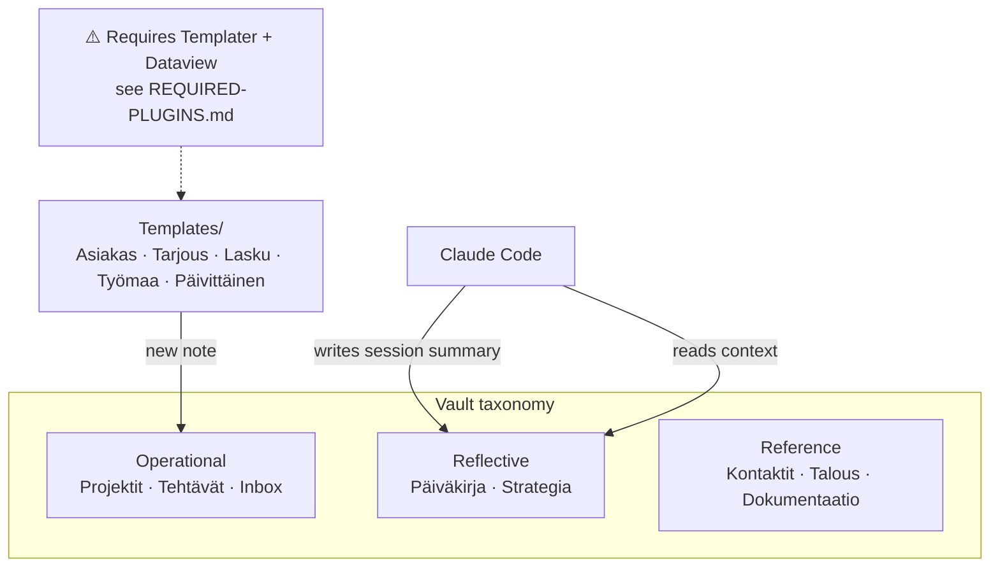

# obsidian-vault-template

The **structure and templates** of a working Obsidian vault used as a
founder/operator second brain alongside Claude Code — folder taxonomy and note
templates only.

> 🔒 **No personal content.** This repo deliberately contains **no** diary,
> strategy docs, projects, contacts, or financial data — only the empty folder

## The vault, and how Claude uses it

## What's inside

| Path | What it is |
|------|------------|
| `Templates/` | 6 reusable note templates (in Finnish): `Asiakas.md` (customer), `Tarjous.md` (bid/quote), `Lasku.md` (invoice), `Työmaa.md` (job site), `Päivittäinen.md` (daily note), `Claude-sessio.md` (Claude session log). |
| `structure/` | The folder taxonomy as empty `.gitkeep` scaffolding: Projektit, Strategia, Päiväkirja, Kontaktit, Talous, Inbox, Ideat, Tutkimus, Tehtävät, Kehitys, Dokumentaatio, Arkisto, 10_BRIEFS. |
| `REQUIRED-PLUGINS.md` | Which Obsidian community plugins the templates need (Templater, Dataview) and how to set them up — **read this first**. |
| `.obsidian-community-plugins.json` | The essential plugin IDs, ready to merge into your vault's `.obsidian/community-plugins.json`. |

## How to use
1. Copy `structure/` folders into a new Obsidian vault to get the taxonomy.
2. Copy `Templates/` into the vault and point Obsidian's Templates plugin
   (or Templater) at it.
3. Adapt folder/template names to your own language and workflow.

## Why this taxonomy
The vault separates **operational** notes (Projektit, Tehtävät, Inbox) from
**reflective** notes (Päiväkirja, Strategia) and **reference** (Kontaktit,
Talous, Dokumentaatio). Claude Code writes session summaries into Päiväkirja and
reads Strategia for context (wire this via your `CLAUDE.md`).

## License
[MIT](./LICENSE) © Devosq
